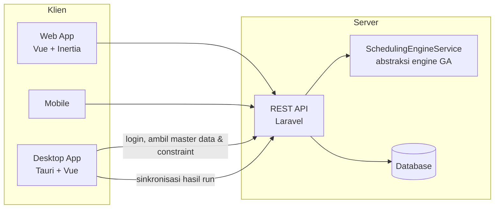
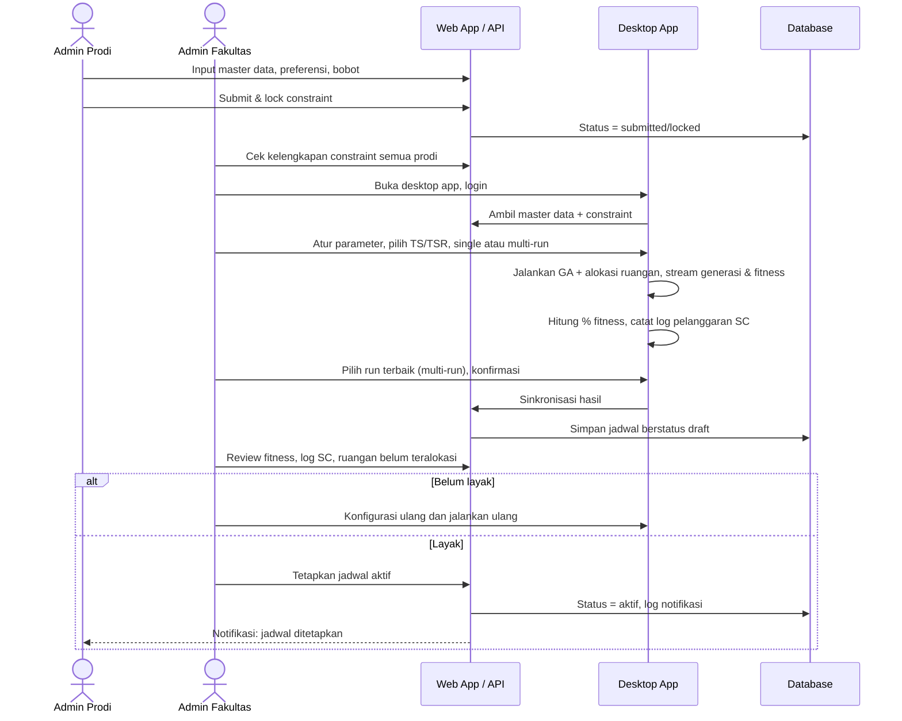

# Sistem Penjadwalan Mata Kuliah Berbasis Algoritma Genetika

> Capstone Project Kelompok 11, Institut Teknologi Kalimantan.

Sistem informasi end-to-end yang membungkus engine Algoritma Genetika (GA) untuk University Course Timetabling Problem (UCTP). Sistem menerima master data dan constraint dari banyak program studi, lalu membangkitkan jadwal bebas bentrok lengkap dengan alokasi ruangan otomatis. Jadwal yang sudah ditetapkan kemudian didistribusikan ke dosen dan mahasiswa. Menjalankan, menyetel, dan membandingkan run penjadwalan tidak memerlukan penyuntingan kode program.

---

## Daftar Isi

- [Latar Belakang](#latar-belakang)
- [Tujuan](#tujuan)
- [Ruang Lingkup dan Batasan](#ruang-lingkup-dan-batasan)
- [Arsitektur](#arsitektur)
- [Peran Pengguna](#peran-pengguna)
- [Modul](#modul)
- [Engine Algoritma Genetika](#engine-algoritma-genetika)
- [Alur Penjadwalan](#alur-penjadwalan)
- [Model Data](#model-data)
- [Evaluasi dan Pengujian](#evaluasi-dan-pengujian)
- [Metodologi Pengembangan](#metodologi-pengembangan)
- [Tim](#tim)
- [Memulai](#memulai)
- [Referensi](#referensi)

---

## Latar Belakang

Penjadwalan mata kuliah termasuk persoalan NP-hard. Penyusunan jadwal secara manual atau lewat spreadsheet menghabiskan waktu berhari-hari dan rawan kesalahan. Cara ini juga sulit menyesuaikan diri ketika data berubah, dan preferensi dosen sering dikorbankan asal jadwal bebas bentrok.

Penelitian GA untuk persoalan ini umumnya masih bersifat eksperimen. Parameter diubah langsung di kode dan luarannya masih mentah. Proyek ini menjembatani kesenjangan tersebut dengan mengemas engine GA ke dalam sistem yang bisa dipakai admin fakultas dan prodi tanpa latar belakang pemrograman. Engine tersebut memakai pengkodean bilangan asli, crossover dan mutasi satu titik, serta seleksi TS dan TSR.

## Tujuan

1. Membangun sistem penjadwalan yang utuh dari hulu ke hilir. Cakupannya autentikasi dan manajemen peran, data induk, konfigurasi dan eksekusi GA, sampai ekspor ke Excel/PDF.
2. Menyediakan modul constraint berisi hard constraint yang tetap dan soft constraint yang bisa dikonfigurasi (preferensi sesi dosen dan kesesuaian SKS-waktu), lengkap dengan bobot pinalti.
3. Mengintegrasikan alokasi ruangan otomatis ke dalam alur eksekusi GA yang sama, termasuk menandai ruangan yang gagal teralokasi.
4. Menyediakan eksekusi multi-run dengan papan perbandingan dan grafik fitness antar operator seleksi (TS vs TSR), serta override manual dengan validasi hard constraint secara real-time.
5. Memberi Dosen dan Mahasiswa akses baca serta ekspor jadwal pribadi (`.ics`). Sistem juga melaporkan metrik evaluasi berupa jumlah pelanggaran soft constraint dan persentase fitness terhadap nilai maksimum teoritis.

## Ruang Lingkup dan Batasan

| Aspek | Termasuk | Tidak termasuk |
|---|---|---|
| Optimasi | Hanya GA: bilangan asli, crossover 1 titik, mutasi 1 titik, seleksi TS dan TSR | Metaheuristik lain |
| Constraint | 4 hard constraint tetap (HC1–HC4). Soft constraint terbatas pada preferensi sesi dosen dan kesesuaian SKS-waktu | Hard constraint yang didefinisikan pengguna |
| Slot waktu | Dibangkitkan otomatis dari kombinasi hari × sesi yang sudah ditetapkan | — |
| Jenis jadwal | Perkuliahan reguler | UTS/UAS, praktikum lab, kuliah lapangan, kegiatan non-perkuliahan |
| Integrasi | Berdiri sendiri | Sistem informasi akademik institusi |
| Luaran | Tabel antarmuka, Excel, PDF, `.ics` | Cetak fisik, pengiriman via surel/pesan |
| Pengujian | Fungsional (black-box) dan UAT pada data studi kasus | Uji keamanan lanjut, uji beban skala besar, deployment produksi |

Studi kasus: Prodi Informatika ITK, kurikulum 2025/2026, semester 1–8. Target skala: 1 fakultas (8 prodi). Skala institut (3 fakultas, 25 prodi) menjadi target aspiratif.

## Arsitektur



| Lapisan | Teknologi | Tanggung jawab |
|---|---|---|
| Web app | Laravel + Vue + Inertia | Master data, pengumpulan constraint, review dan publikasi, tampilan jadwal, ekspor |
| Desktop app | Tauri + Vue | Konfigurasi parameter GA, preset, pemilihan TS/TSR, eksekusi single/multi-run, pemantauan progress, sinkronisasi hasil |
| API | Laravel REST API | Satu backend yang dipakai bersama oleh web, desktop, dan mobile |
| Engine | `SchedulingEngineService` | Interface generik (constraint + config → jadwal) agar GA tidak hardcoded |

Prinsip desain:

- Satu backend menjadi satu sumber kebenaran. Desktop app login memakai akun yang sama dengan web app.
- Satu run GA mencakup seluruh prodi dalam satu fakultas sekaligus, sehingga alokasi ruangan cukup dihitung sekali untuk seluruh unit.

## Peran Pengguna

Hierarki: `Superadmin (Institut) → Admin Fakultas → Admin Prodi → Dosen / Mahasiswa`

| Peran | Tanggung jawab |
|---|---|
| **Superadmin** | Kelola akun dan role, fakultas, prodi, slot waktu. Melihat dashboard utilisasi ruangan tingkat institut |
| **Admin Fakultas** | Kelola ruangan. Mengumpulkan dan mengecek kelengkapan constraint seluruh prodi. Mengonfigurasi parameter GA dan menjalankan penjadwalan (single/multi-run). Me-review hasil dan menetapkan jadwal aktif |
| **Admin Prodi** (Koor Prodi) | Kelola mata kuliah, dosen, dan mapping dosen–matkul. Input preferensi dan bobot, lalu submit & lock constraint. Melihat jadwal dan melakukan override manual |
| **Dosen** | Lihat jadwal mengajar pribadi, ekspor (Excel, PDF, `.ics`) |
| **Mahasiswa** | Lihat jadwal kuliah pribadi, ekspor (Excel, PDF, `.ics`) |

Login, logout, dan reset password dimiliki bersama oleh seluruh pengguna terautentikasi.

## Modul

| # | Modul | Use case utama |
|---|---|---|
| 1 | Autentikasi & Manajemen Akun | Login, logout, reset password, kelola akun dan role |
| 2 | Master Data | CRUD fakultas, prodi, slot waktu (Superadmin); CRUD ruangan (Admin Fakultas); CRUD mata kuliah, dosen, mapping dosen–matkul (Admin Prodi) |
| 3 | Manajemen Constraint | Lihat hard constraint (read-only), input preferensi sesi dosen dan SKS-waktu, atur bobot pinalti/preferensi, submit & lock |
| 4 | Konfigurasi & Eksekusi GA | Atur parameter, simpan/muat preset, pilih TS/TSR, single/multi-run, pantau progress, sinkronisasi hasil, bandingkan run, tetapkan jadwal aktif, notifikasi ke prodi |
| 5 | Alokasi Ruangan | Alokasi otomatis di setiap run, cek bentrok antar prodi, ruangan unassigned/warning, dashboard utilisasi |
| 6 | Manajemen & Tampilan Jadwal | Lihat dan filter jadwal (per dosen/kelas/semester), override manual dengan validasi HC real-time, lihat jadwal pribadi |
| 7 | Ekspor Data | Excel dan PDF (semua role), `.ics` (Dosen, Mahasiswa) |

## Engine Algoritma Genetika

### Representasi

Setiap kromosom mengodekan seluruh perkuliahan dalam bentuk bilangan asli. Data yang dikodekan meliputi kode dan nama mata kuliah, SKS, semester, kelas, dosen pengampu, hari, dan sesi. Setiap kromosom wajib memuat semua mata kuliah yang dijadwalkan.

### Fitness

```
Fitness = Konstanta − Σ pinalti(pelanggaran HC) + Σ preferensi(SC terpenuhi)
```

Kualitas jadwal dilaporkan sebagai persentase terhadap nilai maksimum teoritis. Sebagai acuan, Rossada (2026) melaporkan TSR pada semester genap mencapai 640 dari 645 (99,2%) pada generasi ke-728.

### Constraint

**Hard constraint (tetap, HC1–HC4):**

- Dosen harus sesuai dengan mata kuliah yang diampu
- Tidak ada bentrok jadwal dosen pada slot yang sama
- Tidak ada bentrok pada semester dan kelas yang sama
- Pembatasan jumlah kelas paralel yang berlangsung bersamaan

**Soft constraint (dikonfigurasi per prodi):**

- Preferensi sesi dosen (sel hari-sesi yang disukai/dihindari)
- Kesesuaian SKS terhadap waktu (SC9)

### Operator

| Tahap | Metode |
|---|---|
| Inisialisasi | Kromosom acak sampai jumlahnya memenuhi ukuran populasi |
| Seleksi | **Tournament Selection (TS)**: dua kromosom acak dibandingkan, yang fitness-nya lebih tinggi menang<br/>**Tournament Selection with Roulette Wheel (TSR)**: kandidat dipilih lewat probabilitas roulette wheel berbasis fitness, lalu diadu dalam turnamen |
| Crossover | 1-point crossover |
| Mutasi | 1-point mutation |
| Terminasi | Minimal 500 generasi. Setelah itu, berhenti bila fitness tidak membaik selama 200 generasi. Batas maksimum 1.000 generasi |

### Parameter yang dapat dikonfigurasi

Parameter yang tersedia:

- Ukuran populasi, generasi maksimum, crossover rate, mutation rate
- Operator seleksi (TS/TSR), tournament size, elitism count
- Target fitness dan batas stagnasi
- Bobot HC/SC (default tingkat fakultas, dapat di-override per prodi)

Set parameter dapat disimpan dan dipakai ulang sebagai preset.

## Alur Penjadwalan



Siklus status run: `draft (sementara) → dikonfirmasi → tersinkron → aktif`. Run yang masih sementara dan belum dikonfirmasi saja yang boleh dihapus.

## Model Data

17 entitas, dikelompokkan per domain:

| Kelompok | Entitas |
|---|---|
| Organisasi & pengguna | `PRODI`, `ROLES`, `USERS`, `DOSEN` |
| Master data | `MATA_KULIAH`, `RUANGAN`, `WAKTU_SLOT`, `MATA_KULIAH_DOSEN` (mapping dosen–matkul) |
| Constraint | `HARD_CONSTRAINT` (referensi statis, divalidasi di level aplikasi), `SOFT_CONSTRAINT` (preferensi dosen terhadap slot + bobot) |
| Proses GA | `GA_PARAMETER_PRESET`, `SCHEDULING_RUN` |
| Hasil | `JADWAL_VERSION`, `JADWAL_DETAIL` (matkul × dosen × slot × ruangan) |
| Audit | `LOG_PELANGGARAN` (pelanggaran SC dari GA), `OVERRIDE_PELANGGARAN_HC` (pelanggaran HC akibat override manual), `AUDIT_LOG` |

Relasi penting:

- `USERS` → `PRODI` opsional, karena admin tingkat fakultas tidak terikat ke satu prodi.
- `DOSEN` ↔ `USERS` satu-ke-satu opsional.
- `MATA_KULIAH.jenis_mk` membedakan mata kuliah bersama (TPB) dari mata kuliah prodi, sehingga relasi `MATA_KULIAH` → `PRODI` opsional.
- `JADWAL_VERSION` → `SCHEDULING_RUN` opsional, supaya jadwal hasil plot manual tetap bisa disimpan.
- `GA_PARAMETER_PRESET` 1..n `SCHEDULING_RUN` (agregasi).
- `JADWAL_VERSION` 1..n `JADWAL_DETAIL` (komposisi).

## Evaluasi dan Pengujian

| Jenis | Metode | Metrik / fokus |
|---|---|---|
| Kualitas algoritma | TS vs TSR lewat perbandingan multi-run | Fitness, % fitness terhadap maksimum teoritis, pemenuhan HC/SC, generasi solusi terbaik, waktu eksekusi |
| Fungsional | Black-box testing (equivalence partitioning, boundary value analysis) | Pengelolaan data dan pembangkitan jadwal |
| Penerimaan | User Acceptance Testing | Kemudahan penggunaan, kesesuaian dengan kebutuhan, penerimaan hasil jadwal |

## Metodologi Pengembangan

Agile Scrum dengan sprint berdurasi tetap, disertai sprint planning, daily scrum, sprint review, dan retrospective.

| Sprint | Tanggal (2026) | Fokus |
|---|---|---|
| Sprint 1 | 21 Sep – 4 Okt | Setup, autentikasi, master data |
| Sprint 2 | 5 – 18 Okt | Engine GA, constraint, ruangan |
| Sprint 3 | 19 Okt – 1 Nov | Run penjadwalan, multi-run comparison, ekspor |
| Sprint 4 | 2 – 9 Nov | Stabilisasi, polish frontend, integrasi mobile (checkpoint 90%) |
| Buffer | 10 – 20 Nov | Sisa 10%, bug fix, kesiapan sidang |

## Tim

| Nama | NIM | Peran | Tanggung jawab |
|---|---|---|---|
| Miftahul Fauzi Rifai | 11231040 | Project Manager | Koordinasi, jadwal, sinkronisasi antar divisi, kualitas dan ketepatan waktu |
| Muhammad Zainul Rifki Ramadhan | 11201070 | Frontend (Web) | UI web: autentikasi, master data, pengumpulan/review constraint, review hasil run, penetapan jadwal, tampilan jadwal, ekspor |
| Muhammad Luthfan Thamrin | 11231058 | Frontend (Desktop) | UI desktop: form parameter, preset, TS/TSR, kontrol single/multi-run, progress real-time, sinkronisasi hasil |
| Abiem Akmal Fadhil | 11230002 | AI/ML Engineer | Engine GA: encoding, operator, TS/TSR, fitness, single/multi-run beserta data progress |
| Nurhafid Sudarianto | 11231074 | AI/ML Engineer | Engine GA: encoding, operator, TS/TSR, fitness, single/multi-run beserta data progress |
| Muhammad Nazril Ilham | 11231059 | Backend | Server dan basis data, API auth/role, CRUD master data dan constraint, endpoint sinkronisasi run, endpoint ekspor |
| Riza Luthfie Rusmana | 11231088 | Backend | Server dan basis data, API auth/role, CRUD master data dan constraint, endpoint sinkronisasi run, endpoint ekspor |

## Memulai

Instruksi setup akan ditambahkan setelah struktur repositori difinalkan.

Prasyarat yang diperkirakan: PHP + Composer (Laravel), Node.js (Vue/Inertia), Rust toolchain (Tauri).

## Referensi

- Rossada, R. (2026). *Penjadwalan mata kuliah menggunakan algoritma genetika dengan representasi bilangan asli* (Skripsi sarjana). Institut Teknologi Kalimantan.
- Mahlous, A. R., & Mahlous, H. (2023). Student timetabling genetic algorithm accounting for student preferences. *PeerJ Computer Science, 9*, e1200. https://doi.org/10.7717/peerj-cs.1200
- Nasien, D., & Andi, A. (2022). Optimization of genetic algorithm in courses scheduling. *IT Journal Research and Development, 6*(2), 151–161. https://doi.org/10.25299/itjrd.2022.7896
- Romaguera, D., et al. (2024). Development of a web-based course timetabling system based on an enhanced genetic algorithm. *Procedia Computer Science, 234*, 1714–1721. https://doi.org/10.1016/j.procs.2024.03.177
- Dewi, D. M. K., & Musdholifah, A. (2025). Final assignment exam scheduling optimization using genetic algorithms with tournament selection techniques and violated directed mutation (VDM). *Science, Technology and Communication Journal, 5*(2), 67–80. https://doi.org/10.59190/stc.v5i2.275
- Khaeroni, K., et al. (2025). Towards fair and efficient timetabling: A genetic algorithm model integrating lecturer day-off requests. *IJID, 14*(1), 575–586. https://doi.org/10.14421/ijid.2025.5067

Daftar pustaka lengkap tersedia di dokumen proposal proyek.