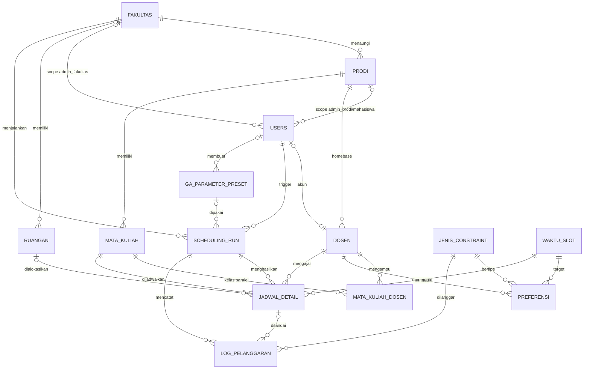

# DATABASE.md

Spesifikasi skema database Sistem Penjadwalan Mata Kuliah Berbasis Algoritma Genetika.
Dokumen ini adalah sumber kebenaran tunggal untuk migration, model, seeder, dan kontrak data engine GA.

---

## 1. Stack & Konvensi

| Item | Ketentuan |
|---|---|
| DBMS | PostgreSQL 17 |
| Framework | Laravel (migration + Eloquent) |
| Primary key | `id BIGSERIAL` → `$table->id()` |
| Foreign key | `BIGINT` → `$table->foreignId('x_id')->constrained()` |
| Penamaan | Tabel & kolom `snake_case`, nama tabel singular sesuai daftar di bawah (set `$table` di model) |
| Timestamps | Semua tabel memakai `created_at` + `updated_at`, **kecuali** `jadwal_detail` dan `log_pelanggaran` (bulk insert, `$timestamps = false`) |
| ON DELETE | Default `RESTRICT`. `CASCADE` hanya untuk `jadwal_detail` dan `log_pelanggaran` ke `scheduling_run` |
| Index FK | PostgreSQL tidak meng-index FK otomatis. **Setiap kolom FK wajib di-index** |
| Constraint kompleks | Partial index dan CHECK ditulis via `DB::statement()` (lihat §7) |

---

## 2. Aturan Bisnis yang Membentuk Skema

1. **Satu run GA = satu fakultas = satu periode.** Semua prodi dalam fakultas dijadwalkan bersamaan.
2. **Satu run menghasilkan satu jadwal** (kromosom terbaik). Tidak ada tabel versi terpisah.
3. **Satu dosen per kelas paralel** (tanpa team teaching). Satu baris `mata_kuliah_dosen` = satu kelas.
4. **SKS menentukan jumlah pertemuan:** 2 dan 3 SKS = 1 pertemuan, 4 SKS = 2 pertemuan. Mata kuliah di luar 2/3/4 SKS (KP, TA, dsb.) di luar cakupan.
5. **Slot bertipe 2 atau 3** (durasi dalam satuan SKS). SC_SKS dievaluasi dari `waktu_slot.tipe`, bukan dari input prodi.
6. **Preferensi dosen bersifat per slot** dengan dua polaritas (`SC_INGIN`, `SC_HINDARI`). Preferensi "sesi X" = satu baris per hari untuk sesi X.
7. **Bobot constraint bersifat global** di `jenis_constraint`, diatur Admin Fakultas, lalu dibekukan ke `scheduling_run.parameter_snapshot` saat run dibuat.
8. **Submit & lock per prodi** lewat `prodi.status_constraint`. Saat `submitted`, master data dan preferensi dosen prodi tersebut read-only (enforce di Policy).
9. **Manual override hanya mengubah `waktu_slot_id` dan `ruangan_id`** di `jadwal_detail`, dan divalidasi terhadap HC di application layer. Jika melanggar HC, override ditolak.
10. **`jadwal_detail` menyimpan snapshot** `mata_kuliah_id`, `kelas_paralel_ke`, `dosen_id` (bukan FK ke `mata_kuliah_dosen`) agar histori run tidak berubah saat mapping diedit.
11. **`ruangan.fakultas_id = NULL`** berarti ruangan shared lintas fakultas. Alokasi ruangan wajib memperhitungkan jadwal aktif fakultas lain pada periode yang sama (§9.3).
12. **Mahasiswa tidak punya data KRS.** Jadwal pribadi mahasiswa = filter `prodi + semester + kelas` dari UI.
13. **Tidak ada entitas TPB dan jurusan.** Mata kuliah wajib milik satu prodi; prodi langsung di bawah fakultas.

---

## 3. Diagram Relasi



---

## 4. Urutan Migration

```
1.  fakultas
2.  prodi
3.  users              (modifikasi migration default Laravel)
4.  dosen
5.  mata_kuliah
6.  mata_kuliah_dosen
7.  ruangan
8.  waktu_slot
9.  jenis_constraint
10. preferensi
11. ga_parameter_preset
12. scheduling_run
13. jadwal_detail
14. log_pelanggaran
15. raw constraints (§7)
```

---

## 5. Skema Tabel

### 5.1 Organisasi & Akun

#### `fakultas`
| Kolom | Tipe | Null | Default | Keterangan |
|---|---|---|---|---|
| id | BIGSERIAL | – | – | PK |
| nama_fakultas | VARCHAR(150) | NO | – | UNIQUE |

#### `prodi`
| Kolom | Tipe | Null | Default | Keterangan |
|---|---|---|---|---|
| id | BIGSERIAL | – | – | PK |
| fakultas_id | BIGINT | NO | – | FK → fakultas |
| nama_prodi | VARCHAR(150) | NO | – | UNIQUE |
| status_constraint | VARCHAR(10) | NO | `'draft'` | Enum §6 |
| constraint_submitted_at | TIMESTAMP | YES | – | Diisi saat submit, di-NULL-kan saat reset ke draft |

#### `users`
| Kolom | Tipe | Null | Default | Keterangan |
|---|---|---|---|---|
| id | BIGSERIAL | – | – | PK |
| name | VARCHAR(150) | NO | – | |
| email | VARCHAR(150) | NO | – | UNIQUE, identitas login |
| password | VARCHAR(255) | NO | – | Hash |
| role | VARCHAR(20) | NO | – | Enum §6 |
| fakultas_id | BIGINT | YES | – | FK → fakultas. Hanya untuk `admin_fakultas` |
| prodi_id | BIGINT | YES | – | FK → prodi. Untuk `admin_prodi` & `mahasiswa` |
| is_active | BOOLEAN | NO | `TRUE` | |
| remember_token | VARCHAR(100) | YES | – | Bawaan Laravel |

Hapus `email_verified_at` dari migration default. Kombinasi role ↔ scope di-enforce oleh `chk_role_scope` (§7).

### 5.2 Master Data

#### `dosen`
| Kolom | Tipe | Null | Default | Keterangan |
|---|---|---|---|---|
| id | BIGSERIAL | – | – | PK |
| user_id | BIGINT | YES | – | FK → users, UNIQUE (relasi 1:1 opsional) |
| prodi_id | BIGINT | NO | – | FK → prodi (homebase) |
| kode_dosen | VARCHAR(10) | NO | – | UNIQUE. Kode inisial (mis. `CCU`). Cegah dosen ganda lintas prodi |
| nama | VARCHAR(150) | NO | – | |
| gelar | VARCHAR(50) | YES | – | |

Dropdown dosen pada mapping menampilkan **seluruh dosen se-fakultas**, bukan hanya prodi sendiri.

#### `mata_kuliah`
| Kolom | Tipe | Null | Default | Keterangan |
|---|---|---|---|---|
| id | BIGSERIAL | – | – | PK |
| prodi_id | BIGINT | NO | – | FK → prodi |
| kode_mk | VARCHAR(20) | NO | – | UNIQUE |
| nama_mk | VARCHAR(150) | NO | – | |
| sks | SMALLINT | NO | – | CHECK `sks IN (2,3,4)` |
| semester | SMALLINT | NO | – | CHECK `semester BETWEEN 1 AND 8` |
| jumlah_kelas_paralel | SMALLINT | NO | `1` | CHECK `>= 1` |
| kapasitas_kelas | SMALLINT | NO | – | CHECK `> 0`. Dibandingkan dengan `ruangan.kapasitas` |

#### `mata_kuliah_dosen`
| Kolom | Tipe | Null | Default | Keterangan |
|---|---|---|---|---|
| id | BIGSERIAL | – | – | PK |
| mata_kuliah_id | BIGINT | NO | – | FK → mata_kuliah |
| kelas_paralel_ke | SMALLINT | NO | – | CHECK `>= 1`; `<= mata_kuliah.jumlah_kelas_paralel` divalidasi di FormRequest |
| dosen_id | BIGINT | NO | – | FK → dosen |

UNIQUE `(mata_kuliah_id, kelas_paralel_ke)`.

#### `ruangan`
| Kolom | Tipe | Null | Default | Keterangan |
|---|---|---|---|---|
| id | BIGSERIAL | – | – | PK |
| fakultas_id | BIGINT | YES | – | FK → fakultas. NULL = shared lintas fakultas |
| nama_ruangan | VARCHAR(100) | NO | – | UNIQUE |
| kapasitas | INT | NO | – | CHECK `> 0` |

#### `waktu_slot`
| Kolom | Tipe | Null | Default | Keterangan |
|---|---|---|---|---|
| id | BIGSERIAL | – | – | PK |
| hari | SMALLINT | NO | – | CHECK `hari BETWEEN 1 AND 5` (1 = Senin … 5 = Jumat) |
| sesi_ke | SMALLINT | NO | – | CHECK `>= 1` |
| jam_mulai | TIME | NO | – | Dipakai export .ics |
| jam_selesai | TIME | NO | – | CHECK `jam_selesai > jam_mulai` |
| tipe | SMALLINT | NO | – | CHECK `tipe IN (2,3)`. Kapasitas slot dalam SKS, dipakai SC_SKS |

UNIQUE `(hari, sesi_ke)`.

### 5.3 Constraint

#### `jenis_constraint`
| Kolom | Tipe | Null | Default | Keterangan |
|---|---|---|---|---|
| id | BIGSERIAL | – | – | PK |
| kode | VARCHAR(20) | NO | – | UNIQUE. Nilai tetap di §6 |
| jenis | CHAR(2) | NO | – | Enum §6 |
| deskripsi | TEXT | NO | – | |
| bobot | NUMERIC(8,2) | NO | – | CHECK `>= 0`. HC = pinalti per pelanggaran, SC = nilai preferensi per pemenuhan. Editable hanya oleh `admin_fakultas` |

Baris dibuat via seeder saja. Tidak ada endpoint create/delete.

#### `preferensi`
Preferensi slot mengajar dosen. Diinput Admin Prodi dari homebase dosen.

| Kolom | Tipe | Null | Default | Keterangan |
|---|---|---|---|---|
| id | BIGSERIAL | – | – | PK |
| dosen_id | BIGINT | NO | – | FK → dosen. Scope prodi via `dosen.prodi_id` |
| jenis_constraint_id | BIGINT | NO | – | FK → jenis_constraint. Hanya `SC_INGIN` atau `SC_HINDARI` (validasi di FormRequest) |
| waktu_slot_id | BIGINT | NO | – | FK → waktu_slot |

UNIQUE `(dosen_id, waktu_slot_id)`: satu slot hanya boleh punya satu polaritas per dosen.

### 5.4 Penjadwalan GA

#### `ga_parameter_preset`
| Kolom | Tipe | Null | Default | Keterangan |
|---|---|---|---|---|
| id | BIGSERIAL | – | – | PK |
| nama_preset | VARCHAR(100) | NO | – | |
| pop_size | INT | NO | `100` | CHECK `> 0` |
| generasi_min | INT | NO | `500` | CHECK `> 0` |
| generasi_maks | INT | NO | `1000` | CHECK `generasi_maks >= generasi_min` |
| batas_stagnasi | INT | NO | `200` | Berhenti jika fitness tidak naik selama N generasi setelah `generasi_min` |
| crossover_rate | NUMERIC(4,3) | NO | – | CHECK `BETWEEN 0 AND 1` |
| mutation_rate | NUMERIC(4,3) | NO | – | CHECK `BETWEEN 0 AND 1` |
| selection_size | INT | NO | `2` | Tournament size, CHECK `>= 2` |
| operator_seleksi | VARCHAR(3) | NO | – | Enum §6 |
| batas_kelas_paralel | SMALLINT | NO | `5` | Parameter HC4. CHECK `>= 1` |
| created_by | BIGINT | YES | – | FK → users |

#### `scheduling_run`
Satu baris = satu eksekusi GA sekaligus satu jadwal hasil.

| Kolom | Tipe | Null | Default | Keterangan |
|---|---|---|---|---|
| id | BIGSERIAL | – | – | PK |
| batch_id | UUID | NO | – | Grup multi-run. Single run = batch berisi 1 run |
| fakultas_id | BIGINT | NO | – | FK → fakultas |
| periode | VARCHAR(20) | NO | – | Format `YYYY/YYYY-GANJIL` atau `YYYY/YYYY-GENAP` |
| preset_id | BIGINT | YES | – | FK → ga_parameter_preset. NULL jika parameter manual tanpa disimpan |
| parameter_snapshot | JSONB | NO | – | Salinan beku parameter + seed + bobot (§8) |
| status | VARCHAR(10) | NO | `'queued'` | Enum §6 |
| generasi_saat_ini | INT | NO | `0` | Di-update berkala untuk polling progress |
| fitness_saat_ini | NUMERIC(12,4) | YES | – | Di-update berkala untuk polling progress |
| fitness_total | NUMERIC(12,4) | YES | – | Fitness akhir kromosom terbaik |
| fitness_maks | NUMERIC(12,4) | YES | – | Nilai maksimum teoritis |
| generasi_terbaik | INT | YES | – | Generasi saat solusi terbaik ditemukan |
| fitness_history | JSONB | YES | – | Ditulis sekali saat `done` (§8) |
| error_message | TEXT | YES | – | Diisi saat `failed` |
| is_aktif | BOOLEAN | NO | `FALSE` | Jadwal resmi yang ditetapkan |
| triggered_by | BIGINT | NO | – | FK → users |
| started_at | TIMESTAMP | YES | – | |
| finished_at | TIMESTAMP | YES | – | |
| published_by | BIGINT | YES | – | FK → users |
| published_at | TIMESTAMP | YES | – | |

Index tambahan: `(batch_id)`, `(fakultas_id, periode)`. Partial unique + CHECK di §7.

#### `jadwal_detail`
Satu baris = satu gen = satu pertemuan satu kelas.

| Kolom | Tipe | Null | Default | Keterangan |
|---|---|---|---|---|
| id | BIGSERIAL | – | – | PK |
| scheduling_run_id | BIGINT | NO | – | FK → scheduling_run, **ON DELETE CASCADE** |
| mata_kuliah_id | BIGINT | NO | – | FK → mata_kuliah (snapshot) |
| kelas_paralel_ke | SMALLINT | NO | – | Snapshot |
| pertemuan_ke | SMALLINT | NO | `1` | `1` untuk 2/3 SKS; `1` atau `2` untuk 4 SKS |
| dosen_id | BIGINT | NO | – | FK → dosen (snapshot) |
| waktu_slot_id | BIGINT | NO | – | FK → waktu_slot. Boleh diubah override |
| ruangan_id | BIGINT | YES | – | FK → ruangan. NULL = gagal teralokasi. Boleh diubah override |
| is_manual_override | BOOLEAN | NO | `FALSE` | |
| overridden_by | BIGINT | YES | – | FK → users |
| overridden_at | TIMESTAMP | YES | – | |

Tanpa timestamps. UNIQUE `(scheduling_run_id, mata_kuliah_id, kelas_paralel_ke, pertemuan_ke)`. Index tambahan: `(scheduling_run_id, waktu_slot_id)`, `(scheduling_run_id, dosen_id)`, `(scheduling_run_id, ruangan_id)`.

#### `log_pelanggaran`
Mencatat pelanggaran HC dan SC yang tidak terpenuhi dari hasil GA.

| Kolom | Tipe | Null | Default | Keterangan |
|---|---|---|---|---|
| id | BIGSERIAL | – | – | PK |
| scheduling_run_id | BIGINT | NO | – | FK → scheduling_run, **ON DELETE CASCADE** |
| jadwal_detail_id | BIGINT | YES | – | FK → jadwal_detail, **ON DELETE CASCADE**. Untuk highlight slot |
| jenis_constraint_id | BIGINT | NO | – | FK → jenis_constraint |
| penalti | NUMERIC(12,4) | NO | – | HC: bobot pinalti. SC: nilai preferensi yang hilang |
| keterangan | TEXT | YES | – | Contoh: `CCU dijadwalkan di sesi 4 (preferensi sesi 1-2)` |

Tanpa timestamps.

---

## 6. Enum & Nilai Tetap

Simpan sebagai VARCHAR + CHECK, dan buat PHP backed enum di `app/Enums/`.

| Kolom | Nilai | PHP Enum |
|---|---|---|
| `users.role` | `superadmin`, `admin_fakultas`, `admin_prodi`, `dosen`, `mahasiswa` | `Role` |
| `prodi.status_constraint` | `draft`, `submitted` | `StatusConstraint` |
| `jenis_constraint.jenis` | `HC`, `SC` | `JenisConstraint` |
| `jenis_constraint.kode` | `HC1`, `HC2`, `HC3`, `HC4`, `SC_INGIN`, `SC_HINDARI`, `SC_SKS` | `KodeConstraint` |
| `ga_parameter_preset.operator_seleksi` | `TS`, `TSR` | `OperatorSeleksi` |
| `scheduling_run.status` | `queued`, `running`, `done`, `failed` | `StatusRun` |

Matriks scope `users`:

| role | fakultas_id | prodi_id | Scope data |
|---|---|---|---|
| superadmin | NULL | NULL | Semua |
| admin_fakultas | wajib | NULL | `fakultas_id` |
| admin_prodi | NULL | wajib | `prodi_id` |
| mahasiswa | NULL | wajib | `prodi_id` |
| dosen | NULL | NULL | via `dosen.user_id` |

---

## 7. Constraint SQL Mentah

```sql
-- users
ALTER TABLE users ADD CONSTRAINT chk_role CHECK (
  role IN ('superadmin','admin_fakultas','admin_prodi','dosen','mahasiswa')
);
ALTER TABLE users ADD CONSTRAINT chk_role_scope CHECK (
  (role = 'superadmin'     AND fakultas_id IS NULL     AND prodi_id IS NULL) OR
  (role = 'admin_fakultas' AND fakultas_id IS NOT NULL AND prodi_id IS NULL) OR
  (role IN ('admin_prodi','mahasiswa') AND fakultas_id IS NULL AND prodi_id IS NOT NULL) OR
  (role = 'dosen'          AND fakultas_id IS NULL     AND prodi_id IS NULL)
);

-- prodi
ALTER TABLE prodi ADD CONSTRAINT chk_status_constraint
  CHECK (status_constraint IN ('draft','submitted'));

-- mata_kuliah
ALTER TABLE mata_kuliah ADD CONSTRAINT chk_sks CHECK (sks IN (2,3,4));

-- waktu_slot
ALTER TABLE waktu_slot ADD CONSTRAINT chk_tipe_slot CHECK (tipe IN (2,3));

-- jenis_constraint
ALTER TABLE jenis_constraint ADD CONSTRAINT chk_jenis CHECK (jenis IN ('HC','SC'));

-- ga_parameter_preset
ALTER TABLE ga_parameter_preset ADD CONSTRAINT chk_operator
  CHECK (operator_seleksi IN ('TS','TSR'));

-- scheduling_run
ALTER TABLE scheduling_run ADD CONSTRAINT chk_status_run
  CHECK (status IN ('queued','running','done','failed'));
ALTER TABLE scheduling_run ADD CONSTRAINT chk_aktif_harus_done
  CHECK (NOT is_aktif OR status = 'done');

-- Hanya 1 jadwal aktif per fakultas per periode
CREATE UNIQUE INDEX uq_jadwal_aktif
  ON scheduling_run (fakultas_id, periode) WHERE is_aktif;
```

CHECK sederhana di §5 (rentang angka, `jam_selesai > jam_mulai`, dsb.) ditulis via `DB::statement()` di migration masing-masing tabel.

---

## 8. Struktur JSONB

### `scheduling_run.parameter_snapshot`
```json
{
  "pop_size": 100,
  "generasi_min": 500,
  "generasi_maks": 1000,
  "batas_stagnasi": 200,
  "crossover_rate": 0.8,
  "mutation_rate": 0.1,
  "operator_seleksi": "TSR",
  "selection_size": 2,
  "batas_kelas_paralel": 5,
  "seed": 12345,
  "run_ke": 0,
  "bobot": {
    "HC1": 10, "HC2": 10, "HC3": 10, "HC4": 10,
    "SC_INGIN": 1, "SC_HINDARI": 1, "SC_SKS": 2
  }
}
```
- Dibuat saat run di-queue: salin parameter + seluruh `jenis_constraint.bobot` saat itu + seed (§9.4).
- **Engine GA wajib membaca parameter dan bobot dari snapshot ini**, bukan dari tabel live.
- Cast di model: `'parameter_snapshot' => 'array'`.

### `scheduling_run.fitness_history`
```json
[512.0, 530.5, 541.0, 541.0, 558.25]
```
- Index array = nomor generasi (0-based). Nilai = fitness terbaik generasi tersebut.
- Ditulis **sekali** saat status menjadi `done`. Progress berjalan memakai `generasi_saat_ini` dan `fitness_saat_ini`.
- Cast di model: `'fitness_history' => 'array'`.

---

## 9. Kontrak Data Engine GA

### 9.1 Pembentukan Gen

Untuk satu run (`fakultas_id`, `periode`):

1. Ambil semua `mata_kuliah` milik prodi di fakultas tersebut dengan paritas semester sesuai periode (GANJIL → 1,3,5,7; GENAP → 2,4,6,8).
2. Untuk setiap baris `mata_kuliah_dosen` dari MK tersebut, buat gen sebanyak jumlah pertemuan:

| sks | Jumlah pertemuan | Tipe slot target (SC_SKS) |
|---|---|---|
| 2 | 1 | 2 |
| 3 | 1 | 3 |
| 4 | 2 | 2 |

3. Nilai gen (alel) = `waktu_slot_id`. Setelah run selesai, setiap gen disimpan sebagai satu baris `jadwal_detail`.

### 9.2 Evaluasi Fitness

```
fitness = K − Σ(jumlah_pelanggaran_HC × bobot_HC) + Σ(jumlah_pemenuhan_SC × bobot_SC)
```

`K` ditentukan engine sesuai Laporan TA. `fitness_maks` = K + total nilai SC jika seluruh SC terpenuhi.

| Kode | Satuan hitung | Terpenuhi jika |
|---|---|---|
| HC1 | Per gen | `dosen_id` sama dengan dosen di `mata_kuliah_dosen` untuk (MK, kelas). Selalu terpenuhi karena gen dibentuk dari mapping |
| HC2 | Per pasangan gen | Tidak ada dua gen dengan `dosen_id` dan `waktu_slot_id` yang sama |
| HC3 | Per pasangan gen | Tidak ada dua gen dengan (`prodi_id`, `semester`, `kelas_paralel_ke`) dan `waktu_slot_id` yang sama |
| HC4 | Per (prodi, slot) | Jumlah gen satu prodi pada satu slot ≤ `batas_kelas_paralel` |
| SC_INGIN | Per gen yang dosennya punya ≥1 baris `SC_INGIN` | `waktu_slot_id` ∈ slot `SC_INGIN` dosen tersebut |
| SC_HINDARI | Per gen yang dosennya punya ≥1 baris `SC_HINDARI` | `waktu_slot_id` ∉ slot `SC_HINDARI` dosen tersebut |
| SC_SKS | Per gen | `waktu_slot.tipe` = tipe slot target (§9.1) |

Setiap HC yang dilanggar dan SC yang tidak terpenuhi pada kromosom terbaik ditulis ke `log_pelanggaran`.

### 9.3 Alokasi Ruangan

Dijalankan setelah GA selesai, di luar fungsi fitness. Untuk setiap `jadwal_detail`:

1. Kandidat = `ruangan` dengan `fakultas_id` = fakultas run **atau** `NULL`.
2. Keluarkan ruangan yang sudah dipakai pada `waktu_slot_id` yang sama, baik di run ini maupun di run `is_aktif` fakultas lain pada `periode` yang sama.
3. Keluarkan ruangan dengan `kapasitas < mata_kuliah.kapasitas_kelas`.
4. Pilih kapasitas terkecil yang cukup (best fit). Jika tidak ada kandidat, `ruangan_id = NULL`.

### 9.4 Pembentukan Batch Multi-Run

Request multi-run berisi parameter dasar + daftar nilai yang di-grid:

```json
{
  "fakultas_id": 1,
  "periode": "2025/2026-GANJIL",
  "pop_size": 100, "generasi_min": 500, "generasi_maks": 1000,
  "batas_stagnasi": 200, "selection_size": 2,
  "crossover_rates": [0.1, 0.5, 0.9],
  "mutation_rates": [0.1, 0.5, 0.9],
  "operator_seleksi": ["TS", "TSR"],
  "batas_kelas_paralel": [4, 5],
  "run_count": 10,
  "base_seed": 12345
}
```

- Jumlah run = produk kartesius seluruh daftar × `run_count`. Semua run memakai `batch_id` yang sama.
- `seed` tiap run = `base_seed + run_ke`, dengan `run_ke` = 0..`run_count − 1`. Kombinasi parameter berbeda memakai deret seed yang sama agar perbandingan TS vs TSR adil.
- Batasi dengan `config('ga.max_runs_per_batch')` (default 100). Grid penuh Laporan TA (9 Cr × 9 Mr × 2 operator × 2 batas paralel × 10 run = 3.240 run) dijalankan lewat Artisan command, bukan dari UI.

---

## 10. Seeder

### 10.1 Struktur

```
database/seeders/
├── DatabaseSeeder.php          → selalu: Reference; jika APP_ENV != production: Demo
├── Reference/
│   ├── FakultasProdiSeeder.php
│   ├── WaktuSlotSeeder.php
│   ├── RuanganSeeder.php
│   ├── JenisConstraintSeeder.php
│   └── SuperadminSeeder.php
├── Demo/
│   ├── MasterDataCsvSeeder.php
│   └── DemoAccountSeeder.php
└── data/
    └── {slug-prodi}/            → mis. informatika/, sistem-informasi/
        ├── dosen.csv
        ├── mata_kuliah.csv
        ├── mata_kuliah_dosen.csv
        └── preferensi.csv       (opsional)
```

Urutan eksekusi: `FakultasProdiSeeder` → `WaktuSlotSeeder` → `RuanganSeeder` → `JenisConstraintSeeder` → `SuperadminSeeder` → `MasterDataCsvSeeder` → `DemoAccountSeeder`.

Konfigurasi `.env`:

| Key | Default | Dipakai oleh |
|---|---|---|
| `SUPERADMIN_EMAIL` | `superadmin@penjadwalan.test` | SuperadminSeeder |
| `SUPERADMIN_PASSWORD` | – (wajib diisi) | SuperadminSeeder |
| `SEED_DEFAULT_PASSWORD` | `password` | DemoAccountSeeder |
| `SEED_KAPASITAS_RUANGAN` | `40` | RuanganSeeder (sampai data kapasitas riil tersedia) |
| `SEED_KAPASITAS_KELAS` | `40` | MasterDataCsvSeeder, jika kolom `kapasitas_kelas` di CSV kosong |

### 10.2 `FakultasProdiSeeder` — 3 fakultas, 26 prodi

| Fakultas | Prodi |
|---|---|
| Fakultas Sains dan Teknologi Informasi | Matematika, Ilmu Aktuaria, Statistika, Fisika, Informatika, Sistem Informasi, Bisnis Digital, Teknik Elektro, Teknik Biomedis |
| Fakultas Pembangunan Berkelanjutan | Teknik Perkapalan, Teknik Kelautan, Teknik Lingkungan, Teknik Sistem Perkapalan, Teknik Transportasi Laut, Teknik Sipil, Perencanaan Wilayah dan Kota, Arsitektur, Desain Komunikasi Visual, Teknik Geomatika |
| Fakultas Rekayasa dan Teknologi Industri | Teknik Mesin, Teknik Industri, Teknik Logistik, Teknik Material dan Metalurgi, Teknologi Pangan, Teknik Kimia, Rekayasa Keselamatan |

Semua prodi di-seed dengan `status_constraint = 'draft'`.

### 10.3 `WaktuSlotSeeder` — 20 slot

Hari 1–5 (Senin–Jumat) × 4 sesi berikut:

| sesi_ke | jam_mulai | jam_selesai | tipe |
|---|---|---|---|
| 1 | 08:00 | 10:30 | 3 |
| 2 | 10:30 | 12:00 | 2 |
| 3 | 13:00 | 15:30 | 3 |
| 4 | 15:30 | 17:00 | 2 |

### 10.4 `RuanganSeeder` — 54 ruangan

Gedung `E`, `F`, `G`, masing-masing 18 ruangan:

| Lantai | Nomor | Jumlah |
|---|---|---|
| 1 | 101–106 | 6 |
| 2 | 201–205 | 5 |
| 3 | 301–307 | 7 |

`nama_ruangan` = gedung + nomor (mis. `E101`, `G307`). `fakultas_id = NULL` (shared). `kapasitas = SEED_KAPASITAS_RUANGAN`.

### 10.5 `JenisConstraintSeeder` — 7 baris

| kode | jenis | deskripsi | bobot |
|---|---|---|---|
| HC1 | HC | Dosen mengajar sesuai dengan mata kuliah yang diampu | 10 |
| HC2 | HC | Satu dosen tidak boleh mengajar lebih dari satu kelas pada slot yang sama | 10 |
| HC3 | HC | Mata kuliah dengan prodi, semester, dan kelas yang sama tidak boleh dijadwalkan pada slot yang sama | 10 |
| HC4 | HC | Jumlah kelas satu prodi yang berjalan bersamaan pada satu slot tidak boleh melebihi batas kelas paralel | 10 |
| SC_INGIN | SC | Dosen dijadwalkan pada slot yang diinginkan | 1 |
| SC_HINDARI | SC | Dosen tidak dijadwalkan pada slot yang dihindari | 1 |
| SC_SKS | SC | Mata kuliah 3 SKS pada slot tipe 3; mata kuliah 2 dan 4 SKS pada slot tipe 2 | 2 |

Gunakan `firstOrCreate` berdasarkan `kode` agar re-seed tidak menimpa bobot yang sudah diubah Admin Fakultas.

### 10.6 `SuperadminSeeder`

Satu akun `role = superadmin` dari `SUPERADMIN_EMAIL` / `SUPERADMIN_PASSWORD`. Gunakan `firstOrCreate` berdasarkan email.

### 10.7 `MasterDataCsvSeeder` (demo)

Membaca setiap folder di `database/seeders/data/`. Nama folder = `Str::slug(nama_prodi)`. Folder tanpa pasangan prodi → lempar exception.

Proses **dua tahap** karena dosen bisa mengajar lintas prodi:
1. Semua `dosen.csv` dan `mata_kuliah.csv` dari seluruh folder.
2. Semua `mata_kuliah_dosen.csv` dan `preferensi.csv`, dengan lookup `kode_dosen` global.

Prodi yang folder-nya berisi data lengkap di-set `status_constraint = 'submitted'` agar bisa langsung di-run.

Format CSV (header wajib, UTF-8, pemisah koma):

**`dosen.csv`**
```csv
kode_dosen,nama,gelar
CCU,Nama Lengkap Dosen,S.Kom.
```

**`mata_kuliah.csv`**
```csv
kode_mk,nama_mk,sks,semester,jumlah_kelas_paralel,kapasitas_kelas
IF1101,Algoritma dan Pemrograman,3,1,4,
```
`kapasitas_kelas` kosong → `SEED_KAPASITAS_KELAS`.

**`mata_kuliah_dosen.csv`**
```csv
kode_mk,kelas_paralel_ke,kode_dosen
IF1101,1,CCU
IF1101,2,GAF
```

**`preferensi.csv`**
```csv
kode_dosen,jenis,hari,sesi_ke
CCU,SC_INGIN,,1
```
`hari` kosong → berlaku Senin–Jumat (1 baris CSV menjadi 5 baris `preferensi`). `hari` diisi 1–5 untuk hari tertentu.

**`data/informatika/preferensi.csv`** (data Laporan TA, menghasilkan 65 baris):
```csv
kode_dosen,jenis,hari,sesi_ke
CCU,SC_INGIN,,1
CCU,SC_INGIN,,2
GAF,SC_INGIN,,1
GAF,SC_INGIN,,2
DAR,SC_INGIN,,1
BOB,SC_INGIN,,1
NFA,SC_INGIN,,2
NFA,SC_INGIN,,3
RAM,SC_INGIN,,2
RAM,SC_INGIN,,3
BIP,SC_INGIN,,1
BIP,SC_INGIN,,2
RKP,SC_HINDARI,,4
```

### 10.8 `DemoAccountSeeder` (demo)

Satu akun per role untuk testing dan demo sidang. Password = `SEED_DEFAULT_PASSWORD`.

| email | role | scope |
|---|---|---|
| `admin.fsti@penjadwalan.test` | admin_fakultas | Fakultas Sains dan Teknologi Informasi |
| `admin.if@penjadwalan.test` | admin_prodi | Informatika |
| `dosen.ccu@penjadwalan.test` | dosen | `dosen.user_id` dikaitkan ke `kode_dosen = CCU` |
| `mahasiswa.if@penjadwalan.test` | mahasiswa | Informatika |

---

## 11. Relasi Eloquent

| Model | Tabel | Relasi |
|---|---|---|
| `Fakultas` | fakultas | hasMany `Prodi`, `Ruangan`, `SchedulingRun`, `User` |
| `Prodi` | prodi | belongsTo `Fakultas`; hasMany `Dosen`, `MataKuliah`, `User` |
| `User` | users | belongsTo `Fakultas`, `Prodi`; hasOne `Dosen` |
| `Dosen` | dosen | belongsTo `User`, `Prodi`; hasMany `MataKuliahDosen`, `Preferensi`, `JadwalDetail` |
| `MataKuliah` | mata_kuliah | belongsTo `Prodi`; hasMany `MataKuliahDosen`, `JadwalDetail` |
| `MataKuliahDosen` | mata_kuliah_dosen | belongsTo `MataKuliah`, `Dosen` |
| `Ruangan` | ruangan | belongsTo `Fakultas`; hasMany `JadwalDetail` |
| `WaktuSlot` | waktu_slot | hasMany `Preferensi`, `JadwalDetail` |
| `JenisConstraint` | jenis_constraint | hasMany `Preferensi`, `LogPelanggaran` |
| `Preferensi` | preferensi | belongsTo `Dosen`, `JenisConstraint`, `WaktuSlot` |
| `GaParameterPreset` | ga_parameter_preset | belongsTo `User` (created_by); hasMany `SchedulingRun` |
| `SchedulingRun` | scheduling_run | belongsTo `Fakultas`, `GaParameterPreset`, `User` (triggered_by, published_by); hasMany `JadwalDetail`, `LogPelanggaran` |
| `JadwalDetail` | jadwal_detail | belongsTo `SchedulingRun`, `MataKuliah`, `Dosen`, `WaktuSlot`, `Ruangan`, `User` (overridden_by); hasMany `LogPelanggaran` |
| `LogPelanggaran` | log_pelanggaran | belongsTo `SchedulingRun`, `JadwalDetail`, `JenisConstraint` |

---

## 12. Query Scope & Nilai Turunan

Tidak disimpan sebagai kolom. Implementasikan sebagai local scope / accessor.

| Nama | Model | Definisi |
|---|---|---|
| `jumlah_pertemuan` | MataKuliah | `sks = 4 ? 2 : 1` |
| `tipe_slot_target` | MataKuliah | `sks = 3 ? 3 : 2` |
| `scopeAktif` | SchedulingRun | `is_aktif = true` |
| `scopeDraft` | SchedulingRun | `status = 'done' AND is_aktif = false AND published_at IS NULL` |
| `scopeArsip` | SchedulingRun | `is_aktif = false AND published_at IS NOT NULL` |
| `persen_fitness` | SchedulingRun | `fitness_total / fitness_maks * 100` |
| `durasi_detik` | SchedulingRun | `finished_at - started_at` |
| `jumlah_pelanggaran_hc` | SchedulingRun | `COUNT(log_pelanggaran)` join `jenis_constraint.jenis = 'HC'` |
| `scopeUnassigned` | JadwalDetail | `ruangan_id IS NULL` |
| `scopeOverCapacity` | JadwalDetail | join `mata_kuliah`, `ruangan`: `kapasitas_kelas > ruangan.kapasitas` |
| Utilisasi ruangan | – | Per ruangan pada run aktif: `COUNT(jadwal_detail) / COUNT(waktu_slot) * 100` |
| Kelengkapan submit | Prodi | Setiap `mata_kuliah` semester periode berjalan punya baris `mata_kuliah_dosen` untuk kelas `1..jumlah_kelas_paralel` |

---

## 13. Tabel Bawaan Laravel

Gunakan migration default, tidak perlu dimodifikasi.

| Tabel | Fungsi |
|---|---|
| `password_reset_tokens` | Reset password |
| `sessions` | Session login web |
| `personal_access_tokens` | Token API (Sanctum) untuk desktop & mobile |
| `notifications` | Notifikasi jadwal ditetapkan (database channel) |
| `jobs`, `failed_jobs` | Eksekusi GA via queue |
| `cache` | Opsional, untuk progress run jika polling DB terlalu berat |