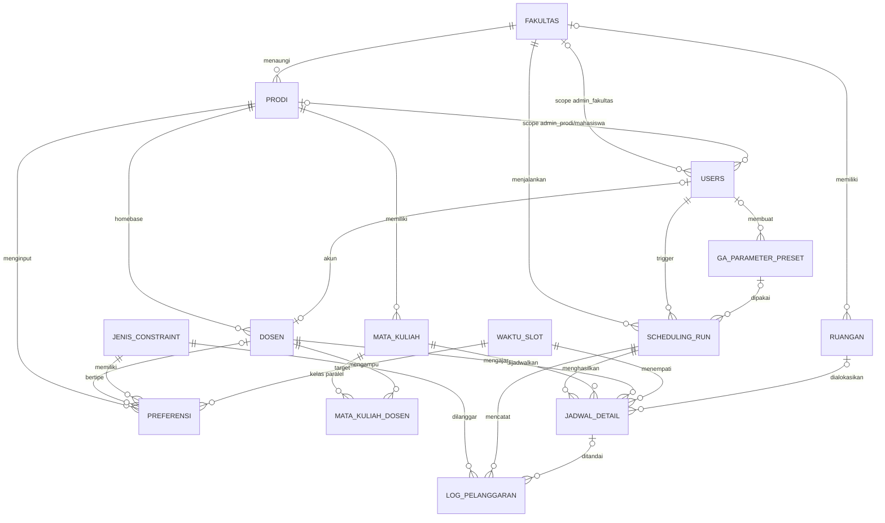
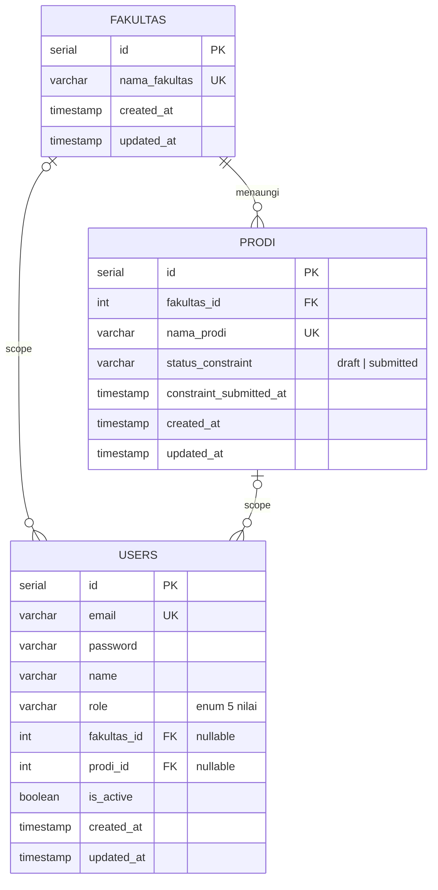
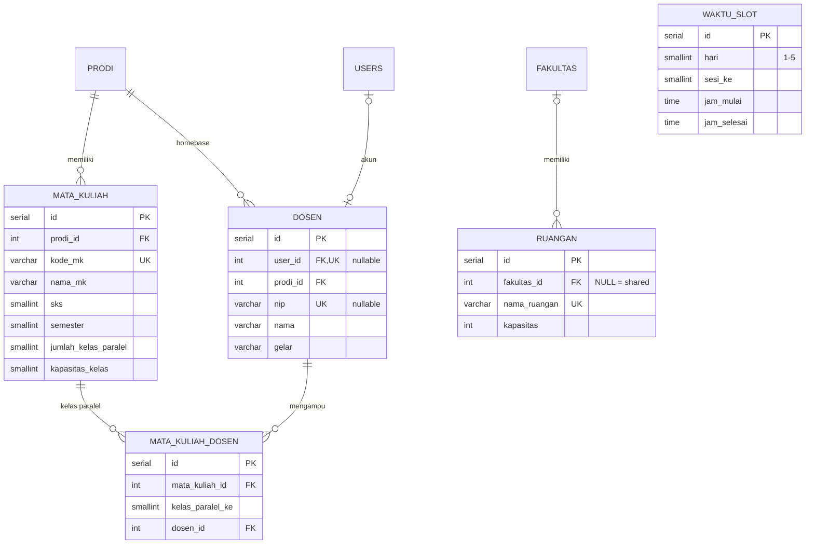
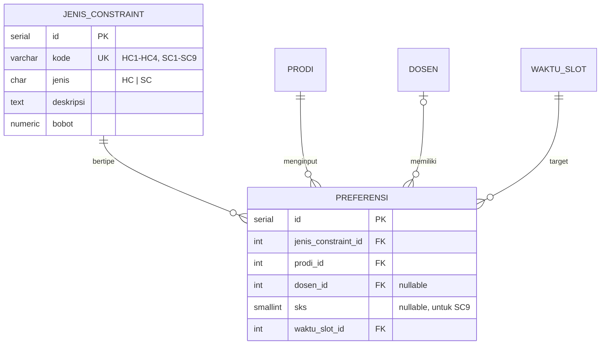
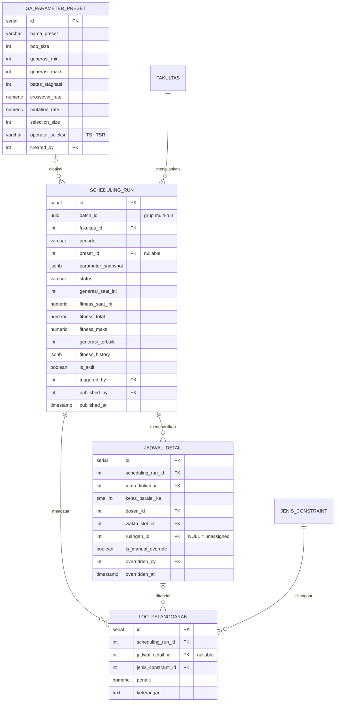

# ERD — Sistem Penjadwalan Mata Kuliah Berbasis Algoritma Genetika

---

## 1. Asumsi yang Dikunci (wajib dikonfirmasi tim)

| # | Asumsi | Dampak jika ditolak |
|---|---|---|
| A1 | Bobot HC & SC bersifat **global**, diatur **Admin Fakultas** (bukan per prodi). Satu run fakultas = satu fungsi fitness. | +1 kolom `prodi_id` nullable di `jenis_constraint` → pindah ke tabel bobot terpisah |
| A2 | **TPB tidak dimodelkan terpisah.** MK TPB yang diajarkan untuk prodi X diinput sebagai MK prodi X. | +`jenis_mk` + tabel mapping kelas TPB ↔ prodi |
| A3 | **1 dosen per kelas paralel** (tanpa team teaching), selaras encoding Rossada (gen = kelas + dosen pengampu tetap). | Hapus UNIQUE di `mata_kuliah_dosen` |
| A4 | **Manual override hanya mengubah `waktu_slot` dan `ruangan`**, bukan dosen. Ganti dosen = ubah master data. | Validasi HC real-time jadi lebih kompleks |
| A5 | **Mahasiswa tidak punya data KRS.** Jadwal pribadi = filter `prodi + semester + kelas` yang dipilih di UI (tidak disimpan). | +tabel `mahasiswa_matkul` |
| A6 | **Tidak ada jadwal manual penuh** (manual plot). Semua jadwal lahir dari run GA; override hanya menyunting hasilnya. | Kembalikan `jadwal_version` |

---

## 2. Peta Relasi Keseluruhan



---

## 3. Modul A — Organisasi & Akun (Modul 1)



### `fakultas` — **TABEL BARU**
| Kolom | Tipe | Constraint | Status | Catatan |
|---|---|---|---|---|
| id | SERIAL | PK | TAMBAH | |
| nama_fakultas | VARCHAR(150) | UNIQUE NOT NULL | TAMBAH | Tanpa `kode`; nama sudah unik |

### `prodi`
| Kolom | Tipe | Constraint | Status | Catatan |
|---|---|---|---|---|
| id | SERIAL | PK | TETAP | |
| fakultas_id | INT | FK → fakultas, NOT NULL | TAMBAH | Scope run GA per fakultas |
| nama_prodi | VARCHAR(150) | UNIQUE NOT NULL | TETAP | |
| status_constraint | VARCHAR(10) | NOT NULL DEFAULT 'draft', CHECK IN ('draft','submitted') | TAMBAH | **Menggantikan tabel submission.** `submitted` = locked |
| constraint_submitted_at | TIMESTAMP | NULL | TAMBAH | Ditampilkan di halaman kelengkapan Admin Fakultas |

> Reset ke `draft` dilakukan Admin Fakultas setelah jadwal periode berjalan ditetapkan, atau saat membuka periode baru.

### `users`
| Kolom | Tipe | Constraint | Status | Catatan |
|---|---|---|---|---|
| id | SERIAL | PK | TETAP | |
| email | VARCHAR(150) | UNIQUE NOT NULL | UBAH | Menggantikan `username`; dibutuhkan reset password |
| password | VARCHAR(255) | NOT NULL | UBAH | Rename dari `password_hash` → default Laravel Auth |
| name | VARCHAR(150) | NOT NULL | UBAH | Rename dari `nama_lengkap` → default Laravel |
| role | VARCHAR(20) | NOT NULL, CHECK | UBAH | Menggantikan `role_id` + tabel `roles` |
| fakultas_id | INT | FK → fakultas, NULL | TAMBAH | Hanya untuk `admin_fakultas` |
| prodi_id | INT | FK → prodi, NULL | TETAP | Untuk `admin_prodi` & `mahasiswa` |
| is_active | BOOLEAN | NOT NULL DEFAULT TRUE | TETAP | |

Nilai `role`: `superadmin`, `admin_fakultas`, `admin_prodi`, `dosen`, `mahasiswa`.

| Role | fakultas_id | prodi_id | Sumber scope |
|---|---|---|---|
| superadmin | NULL | NULL | Semua |
| admin_fakultas | **isi** | NULL | fakultas_id |
| admin_prodi | NULL | **isi** | prodi_id → fakultas |
| mahasiswa | NULL | **isi** | prodi_id |
| dosen | NULL | NULL | via `dosen.user_id` → `dosen.prodi_id` |

---

## 4. Modul B — Master Data (Modul 2)



### `dosen`
| Kolom | Tipe | Constraint | Status | Catatan |
|---|---|---|---|---|
| id | SERIAL | PK | TETAP | |
| user_id | INT | FK → users, UNIQUE, NULL | TETAP | |
| prodi_id | INT | FK → prodi, NOT NULL | TAMBAH | Homebase; scope CRUD Admin Prodi |
| nip | VARCHAR(30) | UNIQUE NULL | TAMBAH | **Cegah dosen ganda lintas prodi** → HC1 jebol diam-diam |
| nama | VARCHAR(150) | NOT NULL | TETAP | |
| gelar | VARCHAR(50) | NULL | TETAP | |

> Dosen tetap **satu baris** walau mengajar di beberapa prodi. Mapping lintas prodi dilakukan di `mata_kuliah_dosen` (dropdown dosen harus menampilkan dosen se-fakultas, bukan hanya prodi sendiri).

### `mata_kuliah`
| Kolom | Tipe | Constraint | Status | Catatan |
|---|---|---|---|---|
| id | SERIAL | PK | TETAP | |
| prodi_id | INT | FK → prodi, **NOT NULL** | UBAH | Dari nullable (asumsi A2) |
| ~~jenis_mk~~ | – | – | **HAPUS** | TPB tidak dimodelkan (A2) |
| kode_mk | VARCHAR(20) | UNIQUE NOT NULL | TETAP | |
| nama_mk | VARCHAR(150) | NOT NULL | TETAP | |
| sks | SMALLINT | NOT NULL | TETAP | |
| semester | SMALLINT | NOT NULL, CHECK 1–8 | TETAP | Ganjil/genap difilter saat run |
| jumlah_kelas_paralel | SMALLINT | NOT NULL DEFAULT 1 | TETAP | |
| kapasitas_kelas | SMALLINT | NOT NULL | TAMBAH | **Sisi permintaan** untuk cek kapasitas ruangan |

### `mata_kuliah_dosen` (penugasan kelas = unit gen GA)
| Kolom | Tipe | Constraint | Status | Catatan |
|---|---|---|---|---|
| id | SERIAL | PK | TAMBAH | Memudahkan CRUD edit mapping |
| mata_kuliah_id | INT | FK → mata_kuliah, NOT NULL | TETAP | |
| kelas_paralel_ke | SMALLINT | NOT NULL | TAMBAH | Kelas 1..n dari `jumlah_kelas_paralel` |
| dosen_id | INT | FK → dosen, NOT NULL | TETAP | |
| | | UNIQUE (mata_kuliah_id, kelas_paralel_ke) | TAMBAH | Asumsi A3 |

> **Satu baris = satu gen.** Jumlah gen kromosom = jumlah baris tabel ini untuk semester aktif. Validasi kelengkapan submit: setiap MK harus punya baris untuk kelas 1..`jumlah_kelas_paralel`.

### `ruangan`
| Kolom | Tipe | Constraint | Status | Catatan |
|---|---|---|---|---|
| id | SERIAL | PK | TETAP | |
| fakultas_id | INT | FK → fakultas, NULL | TAMBAH | NULL = ruangan shared lintas fakultas (**Keputusan Terbuka #1**) |
| nama_ruangan | VARCHAR(100) | **UNIQUE** NOT NULL | UBAH | Tambah UNIQUE; berfungsi sebagai kode |
| kapasitas | INT | NOT NULL | TETAP | |

### `waktu_slot`
| Kolom | Tipe | Constraint | Status | Catatan |
|---|---|---|---|---|
| id | SERIAL | PK | TETAP | |
| hari | SMALLINT | NOT NULL, CHECK 1–5 | UBAH | Dari VARCHAR → urutan sort benar; label di app |
| sesi_ke | SMALLINT | NOT NULL | TETAP | |
| jam_mulai | TIME | NOT NULL | TAMBAH | **Wajib untuk export .ics** |
| jam_selesai | TIME | NOT NULL | TAMBAH | Idem |
| | | UNIQUE (hari, sesi_ke) | TETAP | |

---

## 5. Modul C — Constraint (Modul 3)



### `jenis_constraint` (rename dari `hard_constraint`)
| Kolom | Tipe | Constraint | Status | Catatan |
|---|---|---|---|---|
| id | SERIAL | PK | TETAP | |
| kode | VARCHAR(10) | UNIQUE NOT NULL | TETAP | Seeder 13 baris: HC1–HC4, SC1–SC9 |
| jenis | CHAR(2) | NOT NULL, CHECK IN ('HC','SC') | TAMBAH | HC read-only untuk Admin Prodi |
| deskripsi | TEXT | NOT NULL | TETAP | |
| bobot | NUMERIC(6,2) | NOT NULL | TAMBAH / PINDAH | Dari `soft_constraint.bobot_penalti`; diatur Admin Fakultas (A1) |

### `preferensi` (rename dari `soft_constraint`)
| Kolom | Tipe | Constraint | Status | Catatan |
|---|---|---|---|---|
| id | SERIAL | PK | TETAP | |
| jenis_constraint_id | INT | FK → jenis_constraint, NOT NULL | UBAH | Menggantikan `kode` VARCHAR |
| prodi_id | INT | FK → prodi, NOT NULL | TAMBAH | Scope Admin Prodi; wajib karena SC9 tidak punya dosen |
| dosen_id | INT | FK → dosen, NULL | TETAP | Terisi untuk preferensi sesi dosen |
| sks | SMALLINT | NULL | TAMBAH | Terisi untuk SC9 (SKS → sesi) |
| waktu_slot_id | INT | FK → waktu_slot, NOT NULL | UBAH | Dari nullable |
| ~~bobot_penalti~~ | – | – | **HAPUS** | Pindah ke `jenis_constraint.bobot` |
| ~~status~~ | – | – | **HAPUS** | Self-service dosen = scope creep |

> **Polaritas suka/hindari tidak butuh kolom baru.** Encode lewat kode SC (misal SC1 = "dosen ingin di slot", SC2 = "dosen menghindari slot"). Sesuaikan dengan definisi SC1–SC9 di Laporan TA.

---

## 6. Modul D — Eksekusi GA & Hasil Jadwal (Modul 4)



### `ga_parameter_preset`
| Kolom | Tipe | Constraint | Status | Catatan |
|---|---|---|---|---|
| id, nama_preset, pop_size, generasi_min, generasi_maks | – | – | TETAP | |
| batas_stagnasi | INT | NOT NULL DEFAULT 200 | TAMBAH | Kriteria terminasi Rossada (200 generasi tanpa peningkatan) |
| crossover_rate, mutation_rate | NUMERIC(4,3) | NOT NULL | TETAP | |
| selection_size | INT | NOT NULL | TETAP | = tournament size |
| operator_seleksi | VARCHAR(3) | CHECK IN ('TS','TSR') | TETAP | |
| ~~run_count~~ | – | – | **HAPUS** | Jumlah run ditentukan saat submit batch, bukan properti preset |
| ~~base_seed~~ | – | – | **HAPUS** | Seed milik run, disimpan di `parameter_snapshot` |
| created_by, created_at | – | – | TETAP | |

### `scheduling_run` (**gabungan `scheduling_run` + `jadwal_version`**)
| Kolom | Tipe | Constraint | Status | Catatan |
|---|---|---|---|---|
| id | SERIAL | PK | TETAP | |
| batch_id | UUID | NOT NULL | TAMBAH | Mengelompokkan multi-run; single run = batch berisi 1 |
| fakultas_id | INT | FK → fakultas, NOT NULL | TAMBAH | Scope run |
| periode | VARCHAR(20) | NOT NULL | UBAH | Rename dari `semester`; format `2026/2027-GANJIL` |
| preset_id | INT | FK → preset, **NULL** | UBAH | Boleh run tanpa simpan preset |
| parameter_snapshot | JSONB | NOT NULL | TAMBAH | Salinan beku parameter + seed + bobot. **Benchmark tetap valid walau preset/bobot diedit** |
| status | VARCHAR(10) | CHECK IN ('queued','running','done','failed') | TETAP | |
| generasi_saat_ini | INT | DEFAULT 0 | TETAP | Polling progress |
| fitness_saat_ini | NUMERIC(10,4) | NULL | TETAP | Polling progress |
| fitness_total | NUMERIC(10,4) | NULL | PINDAH | Dari `jadwal_version` |
| fitness_maks | NUMERIC(10,4) | NULL | TAMBAH | Nilai maksimum teoritis; `persen = total / maks` dihitung di app |
| generasi_terbaik | INT | NULL | TAMBAH | Generasi saat solusi terbaik ditemukan (metrik Bab Hasil) |
| fitness_history | JSONB | NULL | TAMBAH | Array fitness terbaik per generasi → **grafik konvergensi TS vs TSR**. Ditulis sekali saat run selesai |
| is_aktif | BOOLEAN | NOT NULL DEFAULT FALSE | UBAH | Menggantikan `jadwal_version.status` |
| triggered_by | INT | FK → users, NOT NULL | TETAP | |
| started_at, finished_at | TIMESTAMP | NULL | TETAP | Durasi eksekusi = selisih |
| published_by | INT | FK → users, NULL | PINDAH | Dari `jadwal_version` |
| published_at | TIMESTAMP | NULL | PINDAH | Dari `jadwal_version` |
| created_at | TIMESTAMP | NOT NULL DEFAULT NOW() | TETAP | |

Contoh `parameter_snapshot`:
```json
{
  "pop_size": 100, "generasi_min": 500, "generasi_maks": 1000, "batas_stagnasi": 200,
  "crossover_rate": 0.8, "mutation_rate": 0.05,
  "operator_seleksi": "TSR", "selection_size": 2, "seed": 918273645,
  "bobot": { "HC1": 100, "HC2": 100, "HC3": 100, "HC4": 100, "SC1": 5, "SC9": 3 }
}
```

Status turunan (tanpa kolom tambahan):
| Status di UI | Kondisi |
|---|---|
| Berjalan | `status IN ('queued','running')` |
| Draft (siap direview) | `status = 'done' AND is_aktif = FALSE AND published_at IS NULL` |
| Aktif | `is_aktif = TRUE` |
| Arsip | `is_aktif = FALSE AND published_at IS NOT NULL` |

### `jadwal_detail`
| Kolom | Tipe | Constraint | Status | Catatan |
|---|---|---|---|---|
| id | SERIAL | PK | TETAP | |
| scheduling_run_id | INT | FK → scheduling_run, NOT NULL, ON DELETE CASCADE | UBAH | Rename dari `jadwal_version_id` |
| mata_kuliah_id, kelas_paralel_ke, dosen_id | – | – | TETAP | Snapshot, **sengaja tidak FK ke `mata_kuliah_dosen`** agar histori run aman saat mapping diedit periode berikutnya |
| waktu_slot_id | INT | FK NOT NULL | TETAP | Boleh diubah override |
| ruangan_id | INT | FK NULL | TETAP | NULL = unassigned; boleh diubah override |
| is_manual_override | BOOLEAN | DEFAULT FALSE | TETAP | Pengganti audit trail minimal |
| overridden_by, overridden_at | – | NULL | TETAP | |

### `log_pelanggaran` (kini mencakup **HC dan SC**)
| Kolom | Tipe | Constraint | Status | Catatan |
|---|---|---|---|---|
| id | SERIAL | PK | TETAP | |
| scheduling_run_id | INT | FK, NOT NULL, ON DELETE CASCADE | UBAH | Rename dari `jadwal_version_id` |
| jadwal_detail_id | INT | FK, NULL | TETAP | Untuk highlight slot di UI |
| jenis_constraint_id | INT | FK, NOT NULL | UBAH | Dari `soft_constraint_id` → sekarang bisa HC (GA bisa berhenti di solusi infeasible) |
| penalti | NUMERIC(10,4) | NOT NULL | UBAH | Rename dari `penalti_hilang` |
| keterangan | TEXT | NULL | TETAP | Contoh: "Bentrok dengan IF-201 kelas 2" |

---

## 7. Modul Tanpa Tabel Sendiri

| Modul | Sumber data | Logika |
|---|---|---|
| **5 — Alokasi Ruangan** | `jadwal_detail` + `ruangan` + `mata_kuliah` | Unassigned: `ruangan_id IS NULL`. Kapasitas berlebih: `mata_kuliah.kapasitas_kelas > ruangan.kapasitas`. Utilisasi: `COUNT(detail per ruangan) / COUNT(waktu_slot)` pada run `is_aktif` |
| **6 — Tampilan Jadwal** | `jadwal_detail` run aktif | Filter dosen/kelas/semester via join. Override hanya `waktu_slot_id` & `ruangan_id` (A4), divalidasi HC di app sebelum simpan; tolak jika melanggar |
| **6 — Jadwal Pribadi Dosen** | `users → dosen → jadwal_detail` | Filter `dosen_id` |
| **6 — Jadwal Pribadi Mahasiswa** | `users.prodi_id` + pilihan UI | Filter prodi + semester + kelas (A5), tidak disimpan |
| **8 — Export** | Query Modul 6 | .ics memakai `waktu_slot.jam_mulai/jam_selesai` + RRULE mingguan |

---

## 8. Tabel Bawaan Laravel (tidak dimodelkan, cukup dicatat di keterangan ERD)

| Tabel | Dipakai untuk |
|---|---|
| `password_reset_tokens` | Reset Password (Modul 1) |
| `sessions` | Login session |
| `notifications` | Use case *Terima Notifikasi Jadwal Ditetapkan* (database channel) |
| `jobs`, `failed_jobs` | Eksekusi GA via queue di backend (desktop hanya trigger + polling) |

---

## 9. Constraint DB Penting

Jalankan via `DB::statement()` di migration (Laravel Schema Builder tidak mendukung partial index & CHECK kompleks).

```sql
-- Hanya 1 jadwal aktif per fakultas per periode
-- (baru mungkin setelah jadwal_version dilebur ke scheduling_run)
CREATE UNIQUE INDEX uq_jadwal_aktif
  ON scheduling_run (fakultas_id, periode) WHERE is_aktif;

-- Konsistensi role ↔ scope
ALTER TABLE users ADD CONSTRAINT chk_role_scope CHECK (
  (role = 'superadmin'     AND fakultas_id IS NULL     AND prodi_id IS NULL) OR
  (role = 'admin_fakultas' AND fakultas_id IS NOT NULL AND prodi_id IS NULL) OR
  (role IN ('admin_prodi','mahasiswa') AND fakultas_id IS NULL AND prodi_id IS NOT NULL) OR
  (role = 'dosen'          AND fakultas_id IS NULL     AND prodi_id IS NULL)
);

-- Preferensi harus punya target
ALTER TABLE preferensi ADD CONSTRAINT chk_preferensi_target
  CHECK (dosen_id IS NOT NULL OR sks IS NOT NULL);

-- 1 dosen per kelas paralel
ALTER TABLE mata_kuliah_dosen ADD CONSTRAINT uq_kelas_paralel
  UNIQUE (mata_kuliah_id, kelas_paralel_ke);
```

Aturan FK: semua master data `ON DELETE RESTRICT` (sesuai activity diagram "tolak hapus jika masih dipakai"). Hanya `jadwal_detail` dan `log_pelanggaran` yang `CASCADE` ke `scheduling_run`, supaya run draft bisa dihapus bersih.

---

## 10. Yang Dihapus dan Alasannya

| Dihapus | Alasan |
|---|---|
| Tabel `roles` | 5 nilai tetap tanpa atribut. Tabel lookup hanya menambah join + seeder |
| Tabel `audit_log` | Handover: override versi ringan **tanpa audit trail**. Jejak minimum sudah ada di `jadwal_detail.overridden_by/at` |
| Tabel `override_pelanggaran_hc` | Activity 3.3.36: override yang melanggar HC **ditolak** → tabel tidak pernah terisi. Kolomnya juga salinan `audit_log` |
| Tabel `jadwal_version` | 1 run = 1 kromosom terbaik = 1 jadwal. Metode `manual` tidak punya use case (A6) |
| `mata_kuliah.jenis_mk` | TPB tidak dimodelkan (A2) |
| `soft_constraint.status` | Self-service dosen tidak ada di use case |
| `soft_constraint.bobot_penalti` | Bobot adalah properti jenis constraint, bukan tiap baris preferensi |
| `ga_parameter_preset.run_count`, `base_seed` | Properti batch/run, bukan preset |
| `jadwal_version.metode`, `persen_fitness_tercapai` | Metode tunggal (GA); persen bisa diturunkan dari `fitness_total / fitness_maks` |

**Trade-off peleburan `jadwal_version`:** override mengubah hasil GA secara in-place, sehingga slot asli baris yang di-override hilang. Mitigasinya: `fitness_total`, `fitness_history`, dan `log_pelanggaran` sudah beku saat run selesai, dan override hanya dilakukan pada run yang ditetapkan aktif, bukan pada run benchmark. Data Bab Hasil tetap utuh.

---

## 11. Revisi Dokumen Proposal yang Wajib Menyesuaikan

| Bagian | Revisi |
|---|---|
| 1.3 Tujuan poin 4 | Hapus "beserta jejak audit" |
| 3.2.1 Use case Autentikasi | Aktor abstrak "Pengguna Terautentikasi" (**Keputusan Terbuka #2**) |
| 3.2.3 & 3.3.30 Atur Bobot | Aktor pindah ke Admin Fakultas (A1) |
| 3.2.4, 3.3.32, 3.4.32 | Narasi GA dijalankan di backend, desktop sebagai thin client; "Koor TPB" → Admin Fakultas |
| 3.3.6–3.3.17 | Hapus penyebutan "kode" pada fakultas/prodi/ruangan/slot |
| 3.3.36, 3.4.36 Override | Perubahan hanya waktu & ruangan (A4) |
| 3.4.18–3.4.25 | Aktor Superadmin → Admin Prodi |
| 3.5 Class Diagram & 3.6 ERD | 17 → 14 entitas, deskripsi TPB/koordinator dihapus |
| 3.7.17 UI Konfigurasi | "Tournament with replacement" → "Tournament Selection with Roulette Wheel"; hapus elitism count jika engine Rossada tidak memakainya |
| 1.4 Batasan Masalah | Tambah: TPB, KRS mahasiswa, dan team teaching di luar cakupan |

---

## 12. Status Keputusan Terbuka

| # | Keputusan | Pengaruh ke ERD v2 | Blocking |
|---|---|---|---|
| 1 | Ruangan shared lintas fakultas? | `ruangan.fakultas_id` NULL = shared. Jika **ya**, alokasi ruangan wajib mengecualikan slot yang sudah dipakai run aktif fakultas lain pada periode sama | Sprint 2 |
| 2 | Generalisasi "Pengguna Terautentikasi" | Tidak berpengaruh ke ERD; tetap harus diperbaiki di use case | Dokumen |
| 3 | Komponen tambahan dari pembimbing | Jika ada testing performa, `fitness_history` + durasi run sudah cukup sebagai data uji | Sprint 3 |